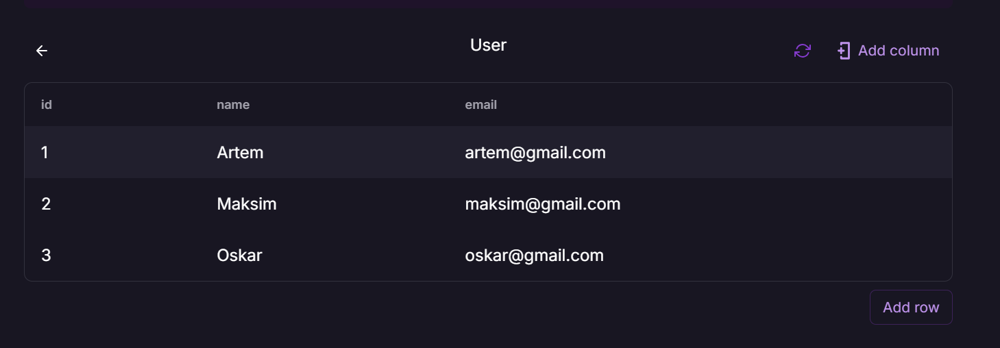

# Country Info API

## Description
This small application provides information about countries and add holidays to the user’s calendar.

## Stack
- Node.js
- TypeScript
- Express.js
- Prisma ORM (PostgreSQl)

## Commands to start working with API
- `npm i` — Install all dependencies.
- `npx prisma generate` — Sychronization with database.
- `npm run build` — Build project.
- `npm run start` — Start server.

## Endpoints
1. Get Available Countries
`GET /api/country/available`

2. Get Country Info
`POST /api/country/info`
- `{ countryCode: 'UA', countryName: 'Ukraine' }` — Example of request body.

3. Register User
`POST /api/users/auth`
- `{ name: 'Ivan', email: 'ivan@gmail.com' }` — Example of request body.

4. Add Holidays To Calendar
`POST /api/users/:userId/calendar/holidays`
- `{
  "countryCode": "US",
  "year": 2025,
  "holidays": ["New Year's Day", "Independence Day"]
}` — Example of request body.

5. Get All Users
`GET /api/users`

6. Get User Info
`GET /api/users/:userId/info`

## Additional Info
- `http://localhost:8000` — Local host.
- Screenshot of existing users in database

